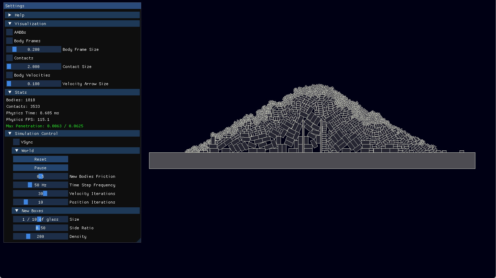
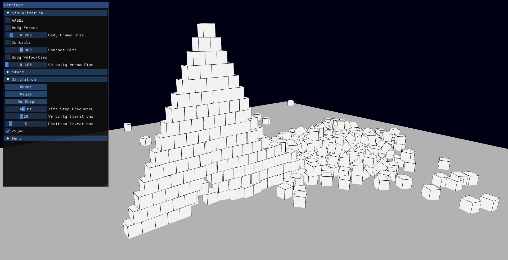

# Neat Physics

A minimalistic 2D/3D physics engine, based on Erin Catto's "Fast and Simple Physics using Sequential Impulses".

Currently the actual developments are done in a private repository, this repository is a public "mirror" with periodical patches.
If you are interested in the actual course of development, please write me on github, I will provide you with a collaborative access.

## Features
- Rigid body dynamics - 2D/3D static and dynamic rigid body simulation with position and velocity integration
- Collision detection - broad-phase and narrow-phase collision detection
- Constraint solver - sequential impulse-based constraint resolution, PBD position correction
- Shape primitives - boxes
- Contact resolution - collision response with friction
- Testbed application - interactive demo environment for testing and visualization

## Getting Started
1. Clone the repository:
2. Install dependencies:
   - Visual Studio 2022 or newer
3. Open and build the solution:
   - Open `build/AllProjects.sln` in Visual Studio and build it
4. Run the **testbed** project:
   - Executables are located in `build/bin/Debug-x64/testbed` and `build/bin/Release-x64/testbed`

## License
This project is licensed under the [MIT License](LICENSE).

## Credits
- [Glad](https://github.com/Dav1dde/glad)
- [GLFW](https://github.com/glfw/glfw)
- [ImGui](https://github.com/ocornut/imgui)
